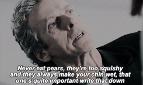

# [fit] ceej's __how to solve it__

---

# [fit] ceej's how to solve it, or
# [fit] __engineering__ at npm

---

# [fit] a series of __maxims__
# [fit] & their __application__ to
# [fit] __problem-solving__ of diverse kinds

---

^ Assisted in this endeavour by my technical advisor & life coach, the Twelfth Doctor.

---

# [fit] dedicated to __David Zink__
# [fit] with whom I have spent 20 happy years arguing about all this

---

# [fit] it takes __decades__ to get good at writing software

---

# [fit] most human beings learn
# [fit] complex skills through __mentorship__

---

# [fit] most programmers learn by working
# [fit] with __more experienced__ programmers

---

# [fit] our industry's booms have caused
# [fit] __shortages__ of experienced mentors

---

# [fit] exacerbated by a modern contempt for
# [fit] anybody __over 40__

^ In case you hadn't noticed, I'm over 40

---

# [fit] too often programmers come of age
# [fit] __without__ experienced people around them

---

# [fit] we keep re-inventing __core tenets__ of our profession

^ the history of operational monitoring at Google I heard at Monitorama was unintentionally hilarious: they slowly reinvented everything the industry was already doing -- this happens over & over

---

# [fit] npm's __engineering staff meeting__
# [fit] me attempting to share what I know
# [fit] and let you share what you know

---

# [fit] lift each other __up__

---

# [fit] therefore... this talk

---

---

# [fit] __systems__ are how things work together

---

# [fit] the npm's registry is a __system__

---

# [fit] __npm__ itself is a system!

---

# [fit] systems __analyst__
# [fit] once the title for people who do what programmers do now

^ tell a personal story here about vocational aptitude testing

---

# [fit] systems exist in a constant state of __failure__
# [fit] __The Systems Bible__ by John Gall

^ Gall was a doctor, writing about the systems he observed; medical profession does a lot of analysis about its processes because lives are at stake

---

> "Every __complex__ working system can be shown to have evolved from a __simple__ working system"

---

# [fit] from this we extract a maxim...

---

# [fit] write the __simplest__ thing you can, every time

---

# [fit] __evolve__ your simple systems to do more
# [fit] keep them working the whole time

---

# [fit] this is true for __people__ systems
# [fit] as well as for computers & code

---

# [fit] Simplicity is prerequisite for reliability.
# [fit] —Edsger W. Dijkstra

---

# [fit] simple is not the same as __easy__
# [fit] Rich Hickey: [Simple Made Easy](https://www.infoq.com/presentations/Simple-Made-Easy)

---

# [fit] Do the simplest thing that moves you toward your goal
# [fit] while preserving your flexibility. —ceej

^ well actually David Zink but I'm stealing credit

---

---

# [fit] __modularity__

---

# [fit] modularity is one of the big __secrets__

---

# [fit] modularity is __hiding__
# [fit] the details of an implementation

---

# [fit] if you __hide__ the details
# [fit] you can __change__ it later

---

# [fit] the other secret is that
# [fit] change is __guaranteed__
# [fit] so prepare for it

---

# [fit] the easy connection is with what npm does:
# [fit] we manage a __javascript__ modules

---

# [fit] modularity's more important applications
# [fit] are at a __systems__ level

---

# [fit] we hide our data __storage__ implementations
# [fit] behind __microservices__

^ Every source of data has exactly one service in front of it mediating all access

---

# [fit] nobody knows if we're using mysql, postgres, or mongodb
# [fit] we can change it without __other services__ caring

---

# [fit] just did this to the __downloads API__
# [fit] mysql ➜ redis

^ it also preserves us from categories of bug that happen when the implementation details leak out (sql injection)

---

---

# [fit] always pronounce the __names__ of things
# [fit] in the __funniest__ possible way

---

# [fit] don't let the __perfect__ be the enemy of the
# [fit] __better__ than what we have now

---

# [fit] continuous __improvement__
# [fit] our products, our processes, our systems

---

# [fit] __iterate__ toward victory!

---

# [fit] don't be __clever__

---

## don't be clever

>“Debugging is twice as hard as writing the code in the first place. Therefore, if you write the code as cleverly as possible, you are, by definition, not smart enough to debug it. ” —Brian Kernighan

---

---

# [fit] __think__

^ Famously once IBM's mantra. My father wanted a desk sign with "think" on it so badly.

---

# [fit] the __RFC__ process is about stopping to think

---

# [fit] what __problem__ are you solving?

---

# [fit] Defining the __problem__ clearly helps you
# [fit] understand what a __solution__ looks like.

---

# [fit] RFC stands for
# [fit] __request for comment__

---

# [fit] seek __feedback__

---

^ Thinking is just a fancy word for changing your mind.

---

# [fit] people make the __best__ decisions they can
# [fit] given their information & abilities

---

# [fit] improving the quality of your __information__
# [fit] will improve your __decisions__

---

# [fit] give __good feedback__ in return

---

# [fit] your colleagues rely on you
# [fit] just as you rely on them

---

# [fit] tie your ego to being right in the __end__
# [fit] not to being right from the __start__

---

---

# [fit] you can't fool me, young man. it's
# [fit] __tradeoffs__
# [fit] all the way down

---

# [fit] what's a __tradeoff__?

---

# [fit] you accept something that's meh in one way
# [fit] but that's great in a way that matters more

^ Talk about mpeg encodings

---

# [fit] every solution to a problem
# [fit] requires __tradeoffs__

---

# [fit] make tradeoffs with your eyes open

---

---

# [fit] I'll phrase that more __positively__

---

# [fit] be __kind__
# [fit] be __courageous__

---

# [fit] be __kind__ to each other

---

# [fit] kindness doesn't mean never saying hard things

---

# [fit] kindness shapes __how__ you say them

---

# [fit] what does __courage__ have to do with problem-solving?

---

# [fit] be __bold__ about tackling hard problems

---

# [fit] be __bold__ about re-examining what we do now

---

# [fit] sometimes you need to __blow everything up__

---

---

# [fit] the companies that survive are
# [fit] __phoenixes__

---

# [fit] all code has a __lifespan__

---

# [fit] code is originally written
# [fit] to solve a __specific__ problem

---

# [fit] our **understanding** of the problem changes
# [fit] the __context__ around it changes
# [fit] the __code__ itself changes

---

# [fit] plan to __replace__
# [fit] all solutions to problems

---

# [fit] feel good about how long your solution lasted!

---

^ Never be cruel or cowardly, and if you are always make amends.

---

# [fit] how we deal with __mistakes__ is important

---

# [fit] because mistakes are __inevitable__

---

# [fit] we try for __blameless postmortems__

---

# [fit] we redesign __processes__
# [fit] when things go wrong

---

# [fit] the __right__ thing to do
# [fit] should be the __easiest__ thing to do

---

# [fit] __work hard__ to make the right thing easy

---

# [fit] do small things daily to __tidy up__

---

^ I really do not know what is up with the pears. He hates 'em.

---

---

# [fit] all code is __communication__

---

# [fit] all of our work requires __communication__

---

# [fit] learning our professions requires __communication__

---

# [fit] how much time in each day do you spend
# [fit] __talking__ to your colleagues?

---

# [fit] do the work to get better at __communicating__

---

# [fit] find where you can get better & do it!
# [fit] writing? chatting in slack?
# [fit] listening to feedback? giving feedback?

---

# [fit] communication skills always pay off

---

^ this is it for me

---

# [fit] never be cruel or cowardly
# [fit] if you are always make amends -- The Twelfth Doctor

---

